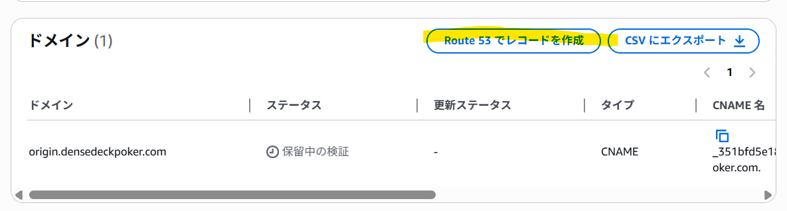
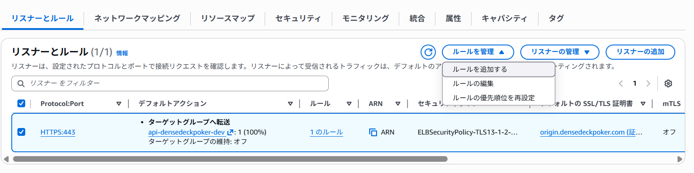

# 概要
- CloudFrton → ALB の通信をHTTPSで実行したい
- ACM で証明書を取得するためには、CloudFrontは証明書のCN/SANと一致するドメインで接続する必要がある
- 以下のような構成になる
```
CloudFront
   ↓（HTTPS）
origin.example.com
   ↓（Route53）
ALB（Aレコード Alias）
   ↓
ターゲット
```

# 作業手順
1. ACM で証明書をリクエスト
    - origin.example.com のような名前で、ALBと同じリージョンに公開証明書を申請する
2. ACM の DNS検証用 CNAME を Route 53 に作成する

3. 証明書が発行されたら ALB を作成
    - HTTPS:443 リスナーに証明書をアタッチする
    - ALB作成後に、リスナーとルールからルールを追加する

4. Route53 に origin.example.com の A(Alias) を作成して ALB に向ける
5. CloudFront の Origin を origin.example.com に設定し、Origin Protocol Policy を HTTPS Only にする