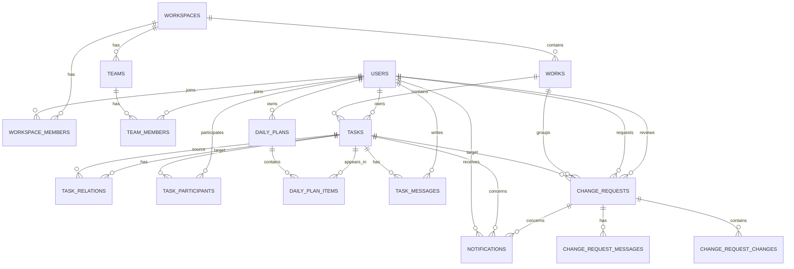

# Today Workspace データモデル設計書
## PostgreSQL / Amazon RDS 想定

- 文書種別: 論理データモデル・初期DDL案
- 対象: MVP
- DBMS: PostgreSQL
- 想定基盤: Amazon RDS for PostgreSQL
- 更新日: 2026-08-05

---

## 1. 目的

本書は、1日〜数日程度の極短期タスク管理・共有アプリ「Today Workspace」のデータモデルを定義する。

本プロダクトでは、以下を主要要件とする。

- タスクを中心に、日次計画、コミュニケーション、変更リクエストを集約する
- 同じ仕事の流れに属する複数タスクを、上位集約IDで束ねる
- タスク間の前後、依存、派生、内訳、関連などを表現する
- 前日の未完了タスクを翌日の計画候補として引き継ぐ
- タスクは複製せず、同一タスクを複数の日次計画から参照する
- 他人からの追加・変更依頼は、Pull Request型の承認フローで処理する
- タスクに紐づくメッセージと変更履歴を永続的に保持する
- 公開範囲および閲覧権限を管理する

---

## 2. 設計方針

### 2.1 データ構造としてはグラフ、永続化先はRDB

タスク間関係はグラフ構造を持つが、MVPではPostgreSQLの隣接リスト形式で表現する。

- ノード: `tasks`
- エッジ: `task_relations`
- グラフ全体を束ねる上位集約: `works`

再帰的な関係探索にはPostgreSQLの再帰CTEを利用する。

### 2.2 WorkとTaskを分離する

`work` は一連の仕事全体を束ねる内部的な集約単位である。

`task` はユーザーが実際に作業し、日次計画へ配置する作業単位である。

```text
Work: 顧客A向け認証機能

├─ Task: 要件確認
├─ Task: API設計
├─ Task: API実装
└─ Task: テスト
```

すべてのTaskが同じ `work_id` を持つ。

新規タスクを単独で作成した場合も、システムがWorkを自動生成する。

### 2.3 タスクを日付に従属させない

Taskは永続的な実体とし、その日に実施するかどうかは `daily_plan_items` で表現する。

```text
Task: API設計

2026-08-05 DailyPlanItem: 今日やる
2026-08-06 DailyPlanItem: 今日やる
2026-08-07 DailyPlanItem: 今日はやらない
```

これにより、タスクに紐づくメッセージや変更履歴を日をまたいで一元管理できる。

### 2.4 タスク間関係は独立テーブルで表現する

子ID、孫IDをTaskのカラムとして保持しない。

すべての関係を `task_relations` に保存する。

---

## 3. 主要エンティティ

```text
workspaces
 ├─ workspace_members
 ├─ teams
 │   └─ team_members
 ├─ works
 │   └─ tasks
 │       ├─ task_relations
 │       ├─ task_messages
 │       ├─ task_participants
 │       ├─ daily_plan_items
 │       └─ change_requests
 │           ├─ change_request_changes
 │           └─ change_request_messages
 ├─ daily_plans
 └─ notifications
```

---

## 4. タスク間関係

### 4.1 関係種別

| relation_type | 意味 | 方向 | 状態制御 |
|---|---|---:|---:|
| `SUBTASK_OF` | sourceはtargetの内訳である | 有向 | 任意 |
| `DERIVED_FROM` | sourceはtargetから派生・継承して生成された | 有向 | なし |
| `PRECEDES` | sourceは工程上targetより前に位置する | 有向 | なし |
| `DEPENDS_ON` | sourceの開始または完了にtargetが必要 | 有向 | あり |
| `RELATED_TO` | sourceとtargetは意味的に関連する | 無向 | なし |
| `DUPLICATE_OF` | sourceはtargetと重複している | 有向 | なし |
| `REPLACES` | sourceがtargetを置き換える | 有向 | 任意 |

### 4.2 方向ルール

関係の向きを以下に統一する。

```text
子タスク SUBTASK_OF 親タスク

派生先 DERIVED_FROM 派生元

前工程 PRECEDES 後工程

依存側 DEPENDS_ON 前提側

重複側 DUPLICATE_OF 正式側

新タスク REPLACES 旧タスク
```

`RELATED_TO` は無向関係だが、DB上では1行のみ保存する。

重複防止のため、保存時に以下の正規化を行う。

```text
source_task_id < target_task_id
```

UUIDの大小比較をアプリケーション側で統一する。

### 4.3 後続タスク作成時の標準動作

元タスクから後続タスクを生成した場合、以下を自動設定する。

```text
新タスク.work_id = 元タスク.work_id

新タスク DERIVED_FROM 元タスク

元タスク PRECEDES 新タスク
```

「元タスクの完了まで開始不可」が指定された場合のみ、追加で以下を設定する。

```text
新タスク DEPENDS_ON 元タスク
```

### 4.4 Workをまたぐ関係

`task_relations` は同一Work内に限定しない。

例:

```text
顧客A障害対応の恒久対応タスク
RELATED_TO
認証基盤改善Workの設計タスク
```

ただし、後続タスク作成による `DERIVED_FROM` は原則として同じ `work_id` を引き継ぐ。

---

## 5. ENUM定義

PostgreSQL ENUMを利用する案を示す。

変更頻度が高い場合はマスタテーブルへ置き換える。

```sql
CREATE TYPE workspace_role AS ENUM (
    'OWNER',
    'ADMIN',
    'MEMBER'
);

CREATE TYPE work_status AS ENUM (
    'ACTIVE',
    'COMPLETED',
    'CANCELLED',
    'ARCHIVED'
);

CREATE TYPE task_status AS ENUM (
    'OPEN',
    'IN_PROGRESS',
    'COMPLETED',
    'ON_HOLD',
    'CANCELLED'
);

CREATE TYPE task_priority AS ENUM (
    'LOW',
    'MEDIUM',
    'HIGH',
    'URGENT'
);

CREATE TYPE visibility_scope AS ENUM (
    'WORKSPACE',
    'TEAM',
    'PARTICIPANTS',
    'OWNER_AND_MANAGER',
    'PRIVATE'
);

CREATE TYPE task_relation_type AS ENUM (
    'SUBTASK_OF',
    'DERIVED_FROM',
    'PRECEDES',
    'DEPENDS_ON',
    'RELATED_TO',
    'DUPLICATE_OF',
    'REPLACES'
);

CREATE TYPE daily_plan_status AS ENUM (
    'DRAFT',
    'CONFIRMED',
    'CLOSED'
);

CREATE TYPE daily_item_status AS ENUM (
    'PLANNED',
    'IN_PROGRESS',
    'DONE',
    'SKIPPED',
    'CARRIED_OVER'
);

CREATE TYPE message_resolution_status AS ENUM (
    'NONE',
    'OPEN',
    'RESOLVED'
);

CREATE TYPE change_request_type AS ENUM (
    'CREATE_TASK',
    'UPDATE_TASK',
    'CANCEL_TASK',
    'ASSIGN_TASK',
    'CHANGE_VISIBILITY',
    'CREATE_FOLLOW_UP'
);

CREATE TYPE change_request_status AS ENUM (
    'DRAFT',
    'OPEN',
    'CHANGES_REQUESTED',
    'APPROVED',
    'REJECTED',
    'MERGED',
    'CLOSED',
    'CONFLICTED'
);

CREATE TYPE notification_type AS ENUM (
    'TASK_MESSAGE',
    'MENTION',
    'CHANGE_REQUEST',
    'REVIEW_REQUEST',
    'TASK_ASSIGNED',
    'TASK_STATUS_CHANGED',
    'DAILY_PLAN_UPDATED'
);
```

---

## 6. テーブル定義

## 6.1 users

アプリケーション利用者。

認証基盤を外部IdPに分離する場合も、内部ユーザーIDは保持する。

```sql
CREATE TABLE users (
    id UUID PRIMARY KEY,
    external_auth_id VARCHAR(255),
    email VARCHAR(320) NOT NULL,
    display_name VARCHAR(100) NOT NULL,
    avatar_url TEXT,
    timezone VARCHAR(64) NOT NULL DEFAULT 'Asia/Tokyo',
    is_active BOOLEAN NOT NULL DEFAULT TRUE,
    created_at TIMESTAMPTZ NOT NULL DEFAULT NOW(),
    updated_at TIMESTAMPTZ NOT NULL DEFAULT NOW(),

    CONSTRAINT users_email_unique UNIQUE (email),
    CONSTRAINT users_external_auth_id_unique UNIQUE (external_auth_id)
);
```

---

## 6.2 workspaces

組織または利用単位。

```sql
CREATE TABLE workspaces (
    id UUID PRIMARY KEY,
    name VARCHAR(150) NOT NULL,
    created_by UUID NOT NULL REFERENCES users(id),
    created_at TIMESTAMPTZ NOT NULL DEFAULT NOW(),
    updated_at TIMESTAMPTZ NOT NULL DEFAULT NOW()
);
```

---

## 6.3 workspace_members

Workspaceへの所属とロール。

```sql
CREATE TABLE workspace_members (
    workspace_id UUID NOT NULL REFERENCES workspaces(id) ON DELETE CASCADE,
    user_id UUID NOT NULL REFERENCES users(id) ON DELETE CASCADE,
    role workspace_role NOT NULL DEFAULT 'MEMBER',
    manager_user_id UUID REFERENCES users(id),
    joined_at TIMESTAMPTZ NOT NULL DEFAULT NOW(),

    PRIMARY KEY (workspace_id, user_id),

    CONSTRAINT workspace_members_no_self_manager
        CHECK (manager_user_id IS NULL OR manager_user_id <> user_id)
);
```

---

## 6.4 teams

Workspace内のチーム。

```sql
CREATE TABLE teams (
    id UUID PRIMARY KEY,
    workspace_id UUID NOT NULL REFERENCES workspaces(id) ON DELETE CASCADE,
    name VARCHAR(150) NOT NULL,
    created_by UUID NOT NULL REFERENCES users(id),
    created_at TIMESTAMPTZ NOT NULL DEFAULT NOW(),
    updated_at TIMESTAMPTZ NOT NULL DEFAULT NOW(),

    CONSTRAINT teams_workspace_name_unique
        UNIQUE (workspace_id, name)
);
```

---

## 6.5 team_members

チーム所属。

```sql
CREATE TABLE team_members (
    team_id UUID NOT NULL REFERENCES teams(id) ON DELETE CASCADE,
    user_id UUID NOT NULL REFERENCES users(id) ON DELETE CASCADE,
    joined_at TIMESTAMPTZ NOT NULL DEFAULT NOW(),

    PRIMARY KEY (team_id, user_id)
);
```

---

## 6.6 works

一連の仕事を束ねる上位集約。

通常はユーザーに強く意識させず、新規タスク作成時に自動生成する。

```sql
CREATE TABLE works (
    id UUID PRIMARY KEY,
    workspace_id UUID NOT NULL REFERENCES workspaces(id) ON DELETE CASCADE,
    title VARCHAR(300) NOT NULL,
    description TEXT,
    owner_user_id UUID NOT NULL REFERENCES users(id),
    status work_status NOT NULL DEFAULT 'ACTIVE',
    visibility visibility_scope NOT NULL DEFAULT 'TEAM',
    version INTEGER NOT NULL DEFAULT 1,
    created_by UUID NOT NULL REFERENCES users(id),
    created_at TIMESTAMPTZ NOT NULL DEFAULT NOW(),
    updated_at TIMESTAMPTZ NOT NULL DEFAULT NOW(),
    completed_at TIMESTAMPTZ,
    archived_at TIMESTAMPTZ,

    CONSTRAINT works_version_positive CHECK (version > 0)
);
```

---

## 6.7 tasks

ユーザーが実際に扱う作業単位。

```sql
CREATE TABLE tasks (
    id UUID PRIMARY KEY,
    workspace_id UUID NOT NULL REFERENCES workspaces(id) ON DELETE CASCADE,
    work_id UUID NOT NULL REFERENCES works(id) ON DELETE CASCADE,
    title VARCHAR(300) NOT NULL,
    description TEXT,
    owner_user_id UUID NOT NULL REFERENCES users(id),
    status task_status NOT NULL DEFAULT 'OPEN',
    priority task_priority NOT NULL DEFAULT 'MEDIUM',
    visibility visibility_scope NOT NULL DEFAULT 'TEAM',
    planned_start_at TIMESTAMPTZ,
    due_at TIMESTAMPTZ,
    version INTEGER NOT NULL DEFAULT 1,
    created_by UUID NOT NULL REFERENCES users(id),
    created_at TIMESTAMPTZ NOT NULL DEFAULT NOW(),
    updated_at TIMESTAMPTZ NOT NULL DEFAULT NOW(),
    started_at TIMESTAMPTZ,
    completed_at TIMESTAMPTZ,
    cancelled_at TIMESTAMPTZ,

    CONSTRAINT tasks_version_positive CHECK (version > 0),
    CONSTRAINT tasks_date_order
        CHECK (
            planned_start_at IS NULL
            OR due_at IS NULL
            OR planned_start_at <= due_at
        )
);
```

`workspace_id` は `work_id` から導出可能だが、以下の用途を考慮し冗長に保持する。

- Workspace単位のRow Level Security
- クエリ簡素化
- パーティショニング候補
- インデックス効率

アプリケーションまたはトリガーで `tasks.workspace_id = works.workspace_id` を保証する。

---

## 6.8 task_participants

タスクの関係者・ウォッチャー。

```sql
CREATE TABLE task_participants (
    task_id UUID NOT NULL REFERENCES tasks(id) ON DELETE CASCADE,
    user_id UUID NOT NULL REFERENCES users(id) ON DELETE CASCADE,
    participant_role VARCHAR(32) NOT NULL DEFAULT 'PARTICIPANT',
    added_by UUID NOT NULL REFERENCES users(id),
    added_at TIMESTAMPTZ NOT NULL DEFAULT NOW(),

    PRIMARY KEY (task_id, user_id)
);
```

---

## 6.9 task_relations

タスク間の関係を表すエッジ。

```sql
CREATE TABLE task_relations (
    id UUID PRIMARY KEY,
    workspace_id UUID NOT NULL REFERENCES workspaces(id) ON DELETE CASCADE,
    source_task_id UUID NOT NULL REFERENCES tasks(id) ON DELETE CASCADE,
    target_task_id UUID NOT NULL REFERENCES tasks(id) ON DELETE CASCADE,
    relation_type task_relation_type NOT NULL,
    created_by UUID NOT NULL REFERENCES users(id),
    created_at TIMESTAMPTZ NOT NULL DEFAULT NOW(),

    CONSTRAINT task_relations_no_self_reference
        CHECK (source_task_id <> target_task_id),

    CONSTRAINT task_relations_unique
        UNIQUE (
            source_task_id,
            target_task_id,
            relation_type
        )
);
```

### 循環禁止対象

以下は循環を禁止する。

- `SUBTASK_OF`
- `PRECEDES`
- `DEPENDS_ON`
- `DERIVED_FROM`

例:

```text
A DEPENDS_ON B
B DEPENDS_ON C
C DEPENDS_ON A
```

循環検出は登録前に再帰CTEで実施する。

`RELATED_TO` は循環概念を持たない。

---

## 6.10 daily_plans

ユーザーごとの日次計画。

```sql
CREATE TABLE daily_plans (
    id UUID PRIMARY KEY,
    workspace_id UUID NOT NULL REFERENCES workspaces(id) ON DELETE CASCADE,
    user_id UUID NOT NULL REFERENCES users(id) ON DELETE CASCADE,
    plan_date DATE NOT NULL,
    status daily_plan_status NOT NULL DEFAULT 'DRAFT',
    created_at TIMESTAMPTZ NOT NULL DEFAULT NOW(),
    updated_at TIMESTAMPTZ NOT NULL DEFAULT NOW(),
    confirmed_at TIMESTAMPTZ,
    closed_at TIMESTAMPTZ,

    CONSTRAINT daily_plans_user_date_unique
        UNIQUE (workspace_id, user_id, plan_date)
);
```

---

## 6.11 daily_plan_items

Taskを特定日の計画へ配置する。

```sql
CREATE TABLE daily_plan_items (
    id UUID PRIMARY KEY,
    daily_plan_id UUID NOT NULL REFERENCES daily_plans(id) ON DELETE CASCADE,
    task_id UUID NOT NULL REFERENCES tasks(id) ON DELETE CASCADE,
    daily_status daily_item_status NOT NULL DEFAULT 'PLANNED',
    display_order INTEGER NOT NULL DEFAULT 0,
    planned_start_at TIMESTAMPTZ,
    planned_end_at TIMESTAMPTZ,
    daily_note TEXT,
    progress_at_start SMALLINT,
    progress_at_end SMALLINT,
    inherited_from_item_id UUID REFERENCES daily_plan_items(id),
    created_at TIMESTAMPTZ NOT NULL DEFAULT NOW(),
    updated_at TIMESTAMPTZ NOT NULL DEFAULT NOW(),

    CONSTRAINT daily_plan_items_plan_task_unique
        UNIQUE (daily_plan_id, task_id),

    CONSTRAINT daily_plan_items_progress_start_range
        CHECK (
            progress_at_start IS NULL
            OR progress_at_start BETWEEN 0 AND 100
        ),

    CONSTRAINT daily_plan_items_progress_end_range
        CHECK (
            progress_at_end IS NULL
            OR progress_at_end BETWEEN 0 AND 100
        ),

    CONSTRAINT daily_plan_items_time_order
        CHECK (
            planned_start_at IS NULL
            OR planned_end_at IS NULL
            OR planned_start_at <= planned_end_at
        )
);
```

### 前日引き継ぎ

翌日の計画作成時、前日の未完了Taskを候補表示する。

引き継ぎを確定した場合、新しい `daily_plan_item` を作成し、以下を設定する。

```text
new_item.task_id = previous_item.task_id
new_item.inherited_from_item_id = previous_item.id
```

Task自体は複製しない。

### 今日はやらない

残課題だが当日の作業対象外とした場合:

```text
tasks.status = OPEN
daily_plan_items.daily_status = SKIPPED
```

通常の今日のTODO一覧では非表示にし、折りたたみ領域などで参照可能にする。

---

## 6.12 task_messages

タスク配下のコミュニケーション。

```sql
CREATE TABLE task_messages (
    id UUID PRIMARY KEY,
    workspace_id UUID NOT NULL REFERENCES workspaces(id) ON DELETE CASCADE,
    task_id UUID NOT NULL REFERENCES tasks(id) ON DELETE CASCADE,
    author_user_id UUID NOT NULL REFERENCES users(id),
    reply_to_message_id UUID REFERENCES task_messages(id) ON DELETE SET NULL,
    body TEXT NOT NULL,
    visibility visibility_scope NOT NULL DEFAULT 'PARTICIPANTS',
    resolution_status message_resolution_status NOT NULL DEFAULT 'NONE',
    created_at TIMESTAMPTZ NOT NULL DEFAULT NOW(),
    updated_at TIMESTAMPTZ NOT NULL DEFAULT NOW(),
    edited_at TIMESTAMPTZ,
    deleted_at TIMESTAMPTZ
);
```

コミュニケーションは日次計画ではなくTaskへ紐づけるため、翌日以降も同一履歴を参照できる。

---

## 6.13 change_requests

他人のTaskを直接変更せず、変更案として申請する。

```sql
CREATE TABLE change_requests (
    id UUID PRIMARY KEY,
    workspace_id UUID NOT NULL REFERENCES workspaces(id) ON DELETE CASCADE,
    work_id UUID REFERENCES works(id) ON DELETE CASCADE,
    target_task_id UUID REFERENCES tasks(id) ON DELETE CASCADE,
    requester_user_id UUID NOT NULL REFERENCES users(id),
    reviewer_user_id UUID NOT NULL REFERENCES users(id),
    request_type change_request_type NOT NULL,
    status change_request_status NOT NULL DEFAULT 'OPEN',
    base_version INTEGER,
    title VARCHAR(300) NOT NULL,
    reason TEXT,
    proposed_payload JSONB,
    created_at TIMESTAMPTZ NOT NULL DEFAULT NOW(),
    updated_at TIMESTAMPTZ NOT NULL DEFAULT NOW(),
    reviewed_at TIMESTAMPTZ,
    merged_at TIMESTAMPTZ,
    closed_at TIMESTAMPTZ,

    CONSTRAINT change_requests_different_users
        CHECK (requester_user_id <> reviewer_user_id),

    CONSTRAINT change_requests_target_required
        CHECK (
            request_type = 'CREATE_TASK'
            OR target_task_id IS NOT NULL
        )
);
```

### `target_task_id`

- `CREATE_TASK`: NULL可
- その他: 必須

### `work_id`

- 新規単独タスク作成: NULL可。承認時にWorkを生成
- 既存Workへのタスク追加: 対象Workを指定
- 既存Task変更: Taskから導出できるが検索効率のため保持可能

### `base_version`

申請作成時点のTask.version。

承認時に現在のTask.versionと不一致なら `CONFLICTED` とする。

---

## 6.14 change_request_changes

フィールド単位の差分。

```sql
CREATE TABLE change_request_changes (
    id UUID PRIMARY KEY,
    change_request_id UUID NOT NULL
        REFERENCES change_requests(id) ON DELETE CASCADE,
    field_name VARCHAR(100) NOT NULL,
    before_value JSONB,
    proposed_value JSONB,
    created_at TIMESTAMPTZ NOT NULL DEFAULT NOW(),

    CONSTRAINT change_request_changes_field_unique
        UNIQUE (change_request_id, field_name)
);
```

構造化された差分表示を行う場合に利用する。

`CREATE_TASK` など変更対象が未生成の場合は、`proposed_payload` に新規Task全体を保持する。

---

## 6.15 change_request_messages

変更リクエストのレビュー会話。

```sql
CREATE TABLE change_request_messages (
    id UUID PRIMARY KEY,
    change_request_id UUID NOT NULL
        REFERENCES change_requests(id) ON DELETE CASCADE,
    author_user_id UUID NOT NULL REFERENCES users(id),
    body TEXT NOT NULL,
    created_at TIMESTAMPTZ NOT NULL DEFAULT NOW(),
    updated_at TIMESTAMPTZ NOT NULL DEFAULT NOW(),
    edited_at TIMESTAMPTZ,
    deleted_at TIMESTAMPTZ
);
```

Taskの通常会話と、変更提案に関するレビュー会話を分離する。

---

## 6.16 notifications

ユーザーへの通知。

```sql
CREATE TABLE notifications (
    id UUID PRIMARY KEY,
    workspace_id UUID NOT NULL REFERENCES workspaces(id) ON DELETE CASCADE,
    recipient_user_id UUID NOT NULL REFERENCES users(id) ON DELETE CASCADE,
    notification_type notification_type NOT NULL,
    task_id UUID REFERENCES tasks(id) ON DELETE CASCADE,
    change_request_id UUID REFERENCES change_requests(id) ON DELETE CASCADE,
    actor_user_id UUID REFERENCES users(id),
    title VARCHAR(300) NOT NULL,
    payload JSONB,
    is_read BOOLEAN NOT NULL DEFAULT FALSE,
    created_at TIMESTAMPTZ NOT NULL DEFAULT NOW(),
    read_at TIMESTAMPTZ
);
```

通知はメッセージ単位で大量生成せず、Task単位で集約する余地を残す。

---

## 7. 主要インデックス

```sql
CREATE INDEX idx_tasks_workspace_owner_status
    ON tasks (workspace_id, owner_user_id, status);

CREATE INDEX idx_tasks_work
    ON tasks (work_id);

CREATE INDEX idx_tasks_due_at
    ON tasks (workspace_id, due_at)
    WHERE due_at IS NOT NULL;

CREATE INDEX idx_task_relations_source_type
    ON task_relations (source_task_id, relation_type);

CREATE INDEX idx_task_relations_target_type
    ON task_relations (target_task_id, relation_type);

CREATE INDEX idx_daily_plans_user_date
    ON daily_plans (workspace_id, user_id, plan_date);

CREATE INDEX idx_daily_plan_items_plan_order
    ON daily_plan_items (daily_plan_id, display_order);

CREATE INDEX idx_daily_plan_items_task
    ON daily_plan_items (task_id);

CREATE INDEX idx_task_messages_task_created
    ON task_messages (task_id, created_at);

CREATE INDEX idx_change_requests_reviewer_status
    ON change_requests (
        workspace_id,
        reviewer_user_id,
        status,
        created_at
    );

CREATE INDEX idx_change_requests_target_task
    ON change_requests (target_task_id)
    WHERE target_task_id IS NOT NULL;

CREATE INDEX idx_notifications_recipient_unread
    ON notifications (
        workspace_id,
        recipient_user_id,
        created_at DESC
    )
    WHERE is_read = FALSE;
```

---

## 8. 代表クエリ

## 8.1 今日の自分のタスク

```sql
SELECT
    t.id,
    t.title,
    t.status,
    t.priority,
    dpi.daily_status,
    dpi.display_order,
    dpi.daily_note
FROM daily_plans dp
JOIN daily_plan_items dpi
  ON dpi.daily_plan_id = dp.id
JOIN tasks t
  ON t.id = dpi.task_id
WHERE dp.workspace_id = :workspace_id
  AND dp.user_id = :user_id
  AND dp.plan_date = :plan_date
  AND dpi.daily_status <> 'SKIPPED'
ORDER BY dpi.display_order, t.created_at;
```

---

## 8.2 チーム全体の今日の予定

```sql
SELECT
    tm.user_id,
    u.display_name,
    t.id AS task_id,
    t.title,
    dpi.daily_status,
    dpi.display_order
FROM team_members tm
JOIN users u
  ON u.id = tm.user_id
LEFT JOIN daily_plans dp
  ON dp.user_id = tm.user_id
 AND dp.workspace_id = :workspace_id
 AND dp.plan_date = :plan_date
LEFT JOIN daily_plan_items dpi
  ON dpi.daily_plan_id = dp.id
 AND dpi.daily_status <> 'SKIPPED'
LEFT JOIN tasks t
  ON t.id = dpi.task_id
WHERE tm.team_id = :team_id
ORDER BY u.display_name, dpi.display_order;
```

---

## 8.3 直接の前提タスク

```sql
SELECT t.*
FROM task_relations tr
JOIN tasks t
  ON t.id = tr.target_task_id
WHERE tr.source_task_id = :task_id
  AND tr.relation_type = 'DEPENDS_ON';
```

---

## 8.4 直接の後工程

```sql
SELECT t.*
FROM task_relations tr
JOIN tasks t
  ON t.id = tr.target_task_id
WHERE tr.source_task_id = :task_id
  AND tr.relation_type = 'PRECEDES';
```

---

## 8.5 後工程を再帰的に取得

```sql
WITH RECURSIVE successors AS (
    SELECT
        tr.source_task_id,
        tr.target_task_id,
        1 AS depth,
        ARRAY[tr.source_task_id, tr.target_task_id] AS path
    FROM task_relations tr
    WHERE tr.source_task_id = :task_id
      AND tr.relation_type = 'PRECEDES'

    UNION ALL

    SELECT
        tr.source_task_id,
        tr.target_task_id,
        s.depth + 1,
        s.path || tr.target_task_id
    FROM task_relations tr
    JOIN successors s
      ON tr.source_task_id = s.target_task_id
    WHERE tr.relation_type = 'PRECEDES'
      AND NOT tr.target_task_id = ANY(s.path)
)
SELECT
    s.depth,
    t.*
FROM successors s
JOIN tasks t
  ON t.id = s.target_task_id
ORDER BY s.depth, t.created_at;
```

---

## 8.6 未完了の前提があるか

```sql
SELECT EXISTS (
    SELECT 1
    FROM task_relations tr
    JOIN tasks prerequisite
      ON prerequisite.id = tr.target_task_id
    WHERE tr.source_task_id = :task_id
      AND tr.relation_type = 'DEPENDS_ON'
      AND prerequisite.status <> 'COMPLETED'
) AS has_unfinished_dependency;
```

---

## 8.7 前日の引き継ぎ候補

```sql
SELECT
    dpi.id AS previous_item_id,
    t.id AS task_id,
    t.title,
    t.status,
    dpi.daily_status,
    dpi.progress_at_end
FROM daily_plans dp
JOIN daily_plan_items dpi
  ON dpi.daily_plan_id = dp.id
JOIN tasks t
  ON t.id = dpi.task_id
WHERE dp.workspace_id = :workspace_id
  AND dp.user_id = :user_id
  AND dp.plan_date = :previous_date
  AND t.status NOT IN ('COMPLETED', 'CANCELLED')
ORDER BY dpi.display_order;
```

完了済みTaskは別クエリで取得し、初期画面では取り消し線表示する。

---

## 9. 状態遷移

## 9.1 Task

```text
OPEN
 ├─> IN_PROGRESS
 ├─> ON_HOLD
 ├─> CANCELLED
 └─> COMPLETED

IN_PROGRESS
 ├─> ON_HOLD
 ├─> CANCELLED
 └─> COMPLETED

ON_HOLD
 ├─> OPEN
 ├─> IN_PROGRESS
 └─> CANCELLED
```

完了済みTaskを再開する場合は、`COMPLETED -> OPEN` または新しい後続Task作成のどちらかをユーザーに選択させる。

## 9.2 ChangeRequest

```text
DRAFT
  -> OPEN

OPEN
  -> CHANGES_REQUESTED
  -> APPROVED
  -> REJECTED
  -> CLOSED
  -> CONFLICTED

CHANGES_REQUESTED
  -> OPEN
  -> CLOSED

APPROVED
  -> MERGED
  -> CONFLICTED

CONFLICTED
  -> OPEN
  -> CLOSED
```

通常は承認操作と同一トランザクションで自動反映し、`APPROVED -> MERGED` まで進める。

---

## 10. 変更リクエスト承認トランザクション

Task更新リクエストの承認処理例。

```text
1. change_requests を FOR UPDATE でロック
2. status = OPEN であることを確認
3. target task を FOR UPDATE でロック
4. task.version = change_request.base_version を確認
5. 不一致なら CONFLICTED
6. 差分をTaskへ適用
7. task.versionを+1
8. change_requestをMERGEDへ更新
9. 通知を作成
10. COMMIT
```

擬似SQL:

```sql
BEGIN;

SELECT *
FROM change_requests
WHERE id = :change_request_id
FOR UPDATE;

SELECT *
FROM tasks
WHERE id = :target_task_id
FOR UPDATE;

-- アプリケーションでversionを比較

UPDATE tasks
SET
    title = :new_title,
    due_at = :new_due_at,
    version = version + 1,
    updated_at = NOW()
WHERE id = :target_task_id
  AND version = :base_version;

-- 更新件数0なら競合

UPDATE change_requests
SET
    status = 'MERGED',
    reviewed_at = NOW(),
    merged_at = NOW(),
    updated_at = NOW()
WHERE id = :change_request_id;

COMMIT;
```

---

## 11. 整合性ルール

### 11.1 Workspace整合性

以下は同じWorkspaceに属する必要がある。

- DailyPlanとTask
- TaskMessageとTask
- ChangeRequestと対象Task
- TaskRelationのsource/target
- TeamMemberとTeam
- WorkとTask

外部キーだけでは完全に保証しづらいため、以下のいずれかを採用する。

1. アプリケーションサービス層で検証
2. 複合外部キーを採用
3. PostgreSQLトリガーで検証

MVPではサービス層で検証し、重要箇所のみトリガーを検討する。

### 11.2 循環依存

`DEPENDS_ON`、`PRECEDES`、`SUBTASK_OF`、`DERIVED_FROM` の登録前に到達可能性を検査する。

新たに `A -> B` を追加する場合、既に `B -> ... -> A` が存在すれば拒否する。

### 11.3 無向関係の正規化

`RELATED_TO` は1組につき1行のみ保存する。

```text
min(source_task_id, target_task_id) をsource
max(source_task_id, target_task_id) をtarget
```

### 11.4 論理削除

Task、Message、ChangeRequestは監査性が重要なため、原則として物理削除しない。

- Task: `CANCELLED` または将来的な `deleted_at`
- Message: `deleted_at`
- ChangeRequest: `CLOSED`

MVPで物理削除を許可するのは、作成直後かつ他データから参照されていない場合に限定する。

---

## 12. 権限設計の基礎

閲覧可能判定は以下を組み合わせる。

- Workspace所属
- Team所属
- Task所有者
- Task参加者
- 上司・部下関係
- `visibility`

### `visibility_scope`

| 値 | 閲覧可能範囲 |
|---|---|
| `WORKSPACE` | Workspace全員 |
| `TEAM` | 所有者と同一チーム |
| `PARTICIPANTS` | 所有者・参加者・必要な管理者 |
| `OWNER_AND_MANAGER` | 所有者と直属上司 |
| `PRIVATE` | 所有者のみ |

TaskMessageはTaskより狭い公開範囲を指定できるが、Taskより広い範囲は指定できない。

---

## 13. PostgreSQL固有機能の利用候補

### 13.1 再帰CTE

TaskRelationの探索に利用する。

### 13.2 JSONB

以下に限定して利用する。

- ChangeRequestの提案ペイロード
- Notificationの補助情報
- 変更前後の値

Task本体やRelation本体は正規化し、JSONBへ寄せすぎない。

### 13.3 Row Level Security

将来的にWorkspace分離をDB層でも保証する場合に検討する。

MVPではアプリケーション層で認可し、必要に応じて導入する。

### 13.4 LISTEN / NOTIFY

リアルタイム通知の主基盤にはせず、内部イベント連携の補助として利用可能。

本番構成ではWebSocket基盤やメッセージキューを別途検討する。

---

## 14. MVPで未採用とするもの

以下は初期データモデルから除外、または将来拡張とする。

- ガントチャート
- 工数実績
- スプリント
- Epic
- 複数段階承認
- 条件付き承認ルール
- タスク関係の重み
- グラフ中心性分析
- 全文検索専用エンジン
- グラフDBとの二重管理
- 添付ファイル本体のDB保存

添付ファイルを追加する場合は、S3へ保存し、PostgreSQLにはメタデータのみ保持する。

---

## 15. 将来拡張候補

### 15.1 イベント履歴

監査ログやタイムラインを強化する場合:

```text
task_events
- id
- workspace_id
- task_id
- event_type
- actor_user_id
- before_data
- after_data
- created_at
```

### 15.2 メンション

```text
message_mentions
- message_id
- user_id
```

### 15.3 添付ファイル

```text
attachments
- id
- workspace_id
- task_id
- message_id
- uploaded_by
- storage_key
- file_name
- content_type
- file_size
```

### 15.4 Relation属性

依存条件などを拡張する場合:

```text
task_relations
- required_task_state
- metadata JSONB
```

例:

```text
DEPENDS_ON
required_task_state = COMPLETED
```

### 15.5 グラフDBの追加判断

以下が主要ユースケースになった場合のみ検討する。

- 数十段以上の関係探索を頻繁に行う
- 関係種別を横断した複雑な到達可能性検索
- 最短経路検索
- ボトルネック・中心性・クラスタ分析
- Workや顧客、資料、ユーザーを含む知識グラフ化

その場合も、PostgreSQLを正本とし、グラフDBを探索用リードモデルとして追加する構成を優先する。

---

## 16. ER図（Mermaid）



---

## 17. まとめ

MVPでは以下を中核とする。

```text
works
    一連の仕事を束ねる上位集約ID

tasks
    ユーザーが扱う永続的な作業単位

task_relations
    タスク間の前後・依存・派生・内訳・関連を表すエッジ

daily_plans / daily_plan_items
    タスクを今日の作業として配置する日次ビュー

task_messages
    タスクに集約されたコミュニケーション

change_requests
    Pull Request型の追加・変更承認

notifications
    対応事項を一元化する受信情報
```

データ構造はグラフ的であるが、主要な利用パターンは日付、ユーザー、チーム、状態による検索・更新である。

そのため、初期実装はAmazon RDS for PostgreSQLを正本とし、`task_relations` と再帰CTEによってグラフ構造を表現する。
